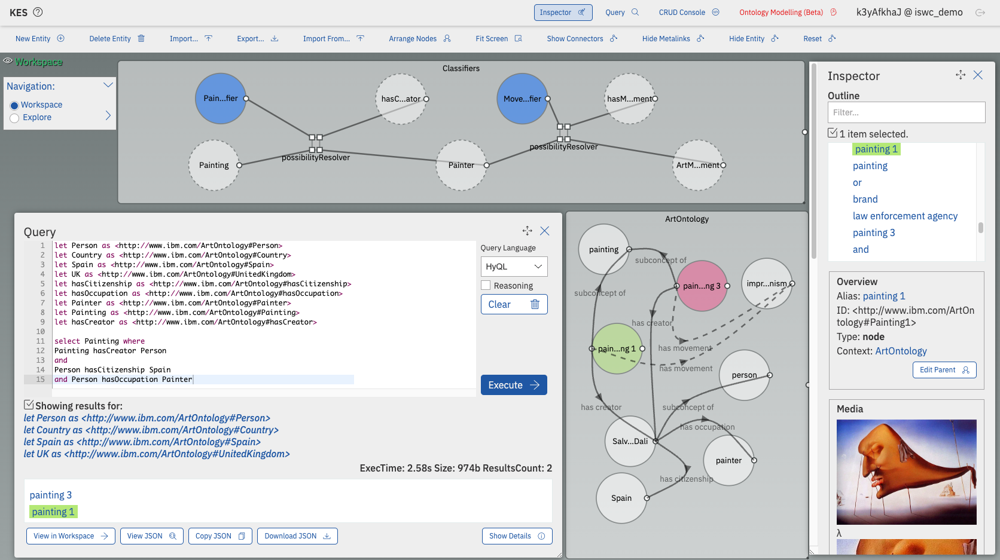

# An Extensible Approach for Query-Driven Multimodal Knowledge Graph Completion

#### Authors: Marcelo Machado, Guilherme Lima, Elton Soares, Vítor Nascimento, Rafael Brandao, and Marcio Moreno
#### Affiliation: At the moment of submission all authors were with IBM Research, Rio de Janeiro - RJ, Brazil, except for Vítor, that was with Universidade Federal Fluminense, Rio de Janeiro - RJ, Brazil.
#### Publication: 21st International Semantic Web Conference, October 23--27, 2022, Hangzhou, China (ISWC2022)

  
## Intro

Knowledge Graphs (KGs) are widely used to enrich applications with factual knowledge about objects in the world. In traditional KG systems, only symbolic content (_e.g._, concepts, instances) is represented, while non-symbolic content (_e.g._, images, videos, scripts) and its integration with the knowledge stored in the KG have to be handled by external systems. In contrast, in Multimodal KGs (MMKGs), the relationships between symbolic and non-symbolic content are represented natively, enabling richer knowledge discovery and consumption.

Because of their generality and scope, real-world KGs and MMKGs are large and often incomplete. This means that important nodes or links might be missing, absences which can decrease the accuracy of queries and inhibit important insights from applications. The KG completion task has emerged to address this problem in a scalable manner. 

Much of the research in KG completion has focused on predicting what is missing based solely on the structure of the graph, usually represented in the form of low dimensional spaces (_i.e._, embedding space), while fewer works have proposed to incorporate both multimodal data and graph structure embeddings into machine learning (ML) models. 
Also, completion techniques typically apply inference rules in batches or ML models to the whole graph.

Our proposal differs from previous approaches in two key aspects:
- It relies on an extensible rule-based mechanism that completes the graph with new links considering the non-symbolic and symbolic data.
- It considers human expertise in the loop since the inference of new links is triggered by the execution of user-defined queries.

Thus, our work provides an interactive and on-demand MMKG completion solution that can be easily extended by the user. 

We instantiate our proposal in IBM's Hyperlinked Knowledge Graph (HKG), an MMKG framework with support for rules, nodes containing executable code, and the capability of representing n-ary relationships among symbolic and non-symbolic data. The figures and videos of this demonstration were made using the Knowledge Explorer System (KES).

## Paper: 

- [Google Drive](https://drive.google.com/file/d/19GR7JZLKf8DWMKoH4n5rBnihyVJRgB_m/view)
- [CEUR](https://ceur-ws.org/Vol-3254/paper353.pdf)

## Demonstration

The goal of this demo is to show HKG features that support extensible query-driven MMKG completion through KES and the Hyperkowledge Query Language (HyQL). The demo uses the [Kaggle’s Best Artworks of All Time dataset](https://www.kaggle.com/ikarus777/best-artworks-of-all-time), two ML models trained over this dataset, and a simple ontology containing painters (Salvador Dalí, Alfred Sisley, etc.), nationalities (Spain, UK, etc.), art movements (Surrealism, Impressionism, Expressionism, etc.), and themes (landscape, portrait, etc.). The images, ML models, and ontology are used to demonstrate how the HKG can be used to infer links from multimodal data at query time while enabling rich semantic queries.

- 1-Minute Teaser: https://youtu.be/uxgAML1KaT8
- MMKG Representation with HKG and KES: https://ibm.box.com/v/iswc2022keg1
- MMKG Completion with HyQL and KES: https://ibm.box.com/v/iswc2022keg2

